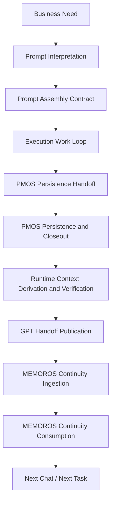

# SG2 Developer Lifecycle Specification v1.0

Status: DERIVED FROM IMPLEMENTATION

Scope: SG-dev + MEMOROS developer ecosystem

Purpose: This document describes the developer lifecycle that already exists in the current implementation. It is the parent architecture from which future developer contracts may be derived.

Source-of-truth rule: When implementation and documentation differ, implementation wins.

## 1. Executive Answer

The current developer lifecycle is not yet a single fully coherent contract architecture.

The implementation already contains a real end-to-end chain:

Business Need -> prompt-side assembly -> execution work loop -> PMOS persistence -> PMOS closeout and handoff -> MEMOROS continuity ingestion -> MEMOROS retrieval and consumption -> next chat / next task

However, the chain is only partially explicit.

- SG-dev contains a strong prompt-side assembly layer and a strong PMOS execution / persistence / closeout layer.
- MEMOROS contains a strong continuity ingestion and continuity consumption layer.
- The boundaries between those layers are real in code, but not yet formalized by one canonical lifecycle specification.
- Some responsibilities are mixed across layers, especially between prompt-side guidance and execution-side law, and between VECTOR naming and PMOS runtime-context ownership.

Therefore:

- The lifecycle exists.
- It is largely operational.
- It is not yet fully explicit or fully non-overlapping as an architectural contract.

## 2. Source Surfaces

The lifecycle below is derived from these primary implementation surfaces:

- SG-dev prompt assembly layer:
  - `packages/governance/src/skills/skill-1-canonical-prompt-protocol/prompt-assembler.ts`
  - `packages/governance/src/skills/skill-1-canonical-prompt-protocol/prompt-assembly-types.ts`
  - `packages/governance/src/skills/skill-1-canonical-prompt-protocol/fragments/skill-1-canonical-vsc-prompt-fragment.md`
- SG-dev persistence and closeout layer:
  - `apps/pmos/scripts/pmos-save.ts`
  - `packages/governance/src/types/index.ts`
  - `packages/governance/src/validation/index.ts`
  - `packages/governance/src/enums/index.ts`
- SG-dev runtime-context and verification layer:
  - `apps/pmos/scripts/build-runtime-context.ts`
  - `apps/pmos/src/lib/pmos/runtime-authority.ts`
  - `apps/pmos/src/lib/pmos/runtime-context-write.ts`
  - `apps/pmos/scripts/check-execution-trail.ts`
  - `apps/pmos/scripts/check-archive-completeness.ts`
  - `apps/vector/scripts/build-runtime-context.ts`
  - `apps/vector/scripts/check-stale-projection.ts`
- MEMOROS continuity ingestion layer:
  - `apps/api/src/integrations/pmos/pmos-artifact-import.service.ts`
  - `apps/api/src/integrations/pmos/pmos-artifact-adapter.ts`
  - `apps/api/src/integrations/pmos/pmos-conversation-artifact-mapper.ts`
  - `apps/api/src/pmos/source-record.service.ts`
  - `apps/api/src/source-identifier/source-lineage.service.ts`
  - `apps/api/src/source-identifier/source-identifier-projection.service.ts`
  - `prisma/schema.prisma`
- MEMOROS continuity consumption layer:
  - `apps/api/src/ask/ask-project.service.ts`
  - `apps/api/src/routes/ask.ts`
  - `apps/api/src/workspace/workspace-chat.service.ts`

## 3. Lifecycle Diagram

## 4. Artifact Flow Diagram

```mermaid
flowchart LR
    A[Business intent] --> B[BusinessDelta / runtime metadata / canonical fragment]
    B --> C[Assembled prompt + prompt evidence]
    C --> D[Workspace edits + validation outputs]
    D --> E[pending-artifact.json]
    E --> F[ConversationArtifact rows + .md/.json/.integrity/.lock]
    F --> G[closeout evidence + execution trail]
    G --> H[runtime-context.md + runtime-context.integrity.json]
    G --> I[HANDOFF artifact in PostgreSQL]
    I --> J[PMOS artifact DTO / historical record]
    J --> K[MEMOROS Thread + SourceRecord]
    K --> L[sourceLineage + SourceIdentifier]
    L --> M[KnowledgeItem / Chunk / retrieval context]
    M --> N[AskProjectResult + sources]
    N --> O[next prompt / next task input]
```

## 5. Lifecycle Stages

### Stage 1 - Business Need

1. Stage name
Business Need

2. Purpose
Provide the upstream change request or analytical objective that starts the developer loop.

3. Start boundary
The moment a user or upstream planner defines a new need outside SG-dev and MEMOROS.

4. End boundary
The moment that need is translated into prompt-oriented task input.

5. Owner
External user / external planner / upstream ChatGPT.

6. Inputs
Business pressure, problem statement, requested outcome.

7. Outputs
Prompt-oriented intent.

8. Produced artifacts
No repository-owned artifact.

9. Consumed artifacts
None from the implementation itself.

10. Canonical source of truth
No first-class canonical model in SG-dev or MEMOROS.

11. Entry points in code
None.

12. Exit points in code
None.

13. Downstream consumer
Prompt Interpretation.

14. Determinism
No.

15. Validation responsibilities
Not implemented in SG-dev or MEMOROS.

16. Failure behaviour
Failure is externalized as poor or incomplete task framing.

17. Historical problems this stage eliminates
None directly. This is the earliest source of possible drift.

18. Long-term stability
Stable as an architectural necessity, but not implemented as a code-owned stage.

19. Dependencies
Human or external system intent.

20. Known implementation limitations
This stage is not modeled explicitly in code. The developer ecosystem receives its output but does not govern its formation.

Implementation references:

- `packages/governance/src/skills/skill-1-canonical-prompt-protocol/prompt-assembly-types.ts`

### Stage 2 - Prompt Interpretation

1. Stage name
Prompt Interpretation

2. Purpose
Translate upstream need into a task-scoped, prompt-consumable shape.

3. Start boundary
Receipt of task-oriented prompt input.

4. End boundary
Availability of structured prompt assembly inputs such as `BusinessDelta`, runtime metadata, and persistence verification state.

5. Owner
External ChatGPT / prompt authoring layer.

6. Inputs
Task prompt, known constraints, current verified state.

7. Outputs
Structured prompt assembly inputs.

8. Produced artifacts
No dedicated persisted artifact in current implementation.

9. Consumed artifacts
Verified implementation state as fed into prompt assembly.

10. Canonical source of truth
Implicit. The implementation only defines the target shape, not the entire interpretation process.

11. Entry points in code
Indirectly represented by the prompt assembly contracts.

12. Exit points in code
Assembly context consumption in `prompt-assembler.ts`.

13. Downstream consumer
Prompt Assembly Contract.

14. Determinism
No.

15. Validation responsibilities
Not fully implemented. Validation begins once structured input exists.

16. Failure behaviour
Drift appears as malformed, incomplete, or policy-violating prompt assembly input.

17. Historical problems this stage eliminates
When done correctly, it reduces ambiguous translation from business need to executable task.

18. Long-term stability
Moderate. The stage is architecturally real but only partially formalized.

19. Dependencies
Business need, current verified implementation state.

20. Known implementation limitations
There is no first-class repository-owned interpreter of business need. The implementation begins at contract validation, not at need interpretation.

Implementation references:

- `packages/governance/src/skills/skill-1-canonical-prompt-protocol/prompt-assembly-types.ts`
- `packages/governance/src/skills/skill-1-canonical-prompt-protocol/prompt-assembler.ts`

### Stage 3 - Prompt Assembly Contract

1. Stage name
Prompt Assembly Contract

2. Purpose
Assemble and validate the prompt surface that will govern execution.

3. Start boundary
Availability of canonical fragment, `BusinessDelta`, `RuntimeMetadata`, and `PersistenceVerificationStatus`.

4. End boundary
Emission of a validated assembled prompt plus integrity evidence.

5. Owner
SG-dev governance prompt assembly layer.

6. Inputs
Canonical fragment, business delta, runtime metadata, persistence verification status.

7. Outputs
`PromptAssemblyResult`, `AssembledPromptEvidence`, validated prompt text.

8. Produced artifacts
Assembled prompt text, hash chain, assembly evidence.

9. Consumed artifacts
Canonical fragment, registries, enums, blocked-pattern rules.

10. Canonical source of truth
The prompt assembly implementation and its canonical fragment.

11. Entry points in code
- `packages/governance/src/skills/skill-1-canonical-prompt-protocol/prompt-assembler.ts`

12. Exit points in code
- `assemblePrompt()` result surfaces
- integrity verification in the same module

13. Downstream consumer
Execution Work Loop.

14. Determinism
Yes, for a fixed input set.

15. Validation responsibilities
Exact naming validation, forbidden pattern detection, fragment integrity verification, command surface validation.

16. Failure behaviour
Fail-closed assembly with validation errors and blocked reasons.

17. Historical problems this stage eliminates
Prompt mutation drift, command drift, naming drift, authority paraphrase drift.

18. Long-term stability
High.

19. Dependencies
Canonical fragment, governance registries, runtime metadata provider.

20. Known implementation limitations
The current fragment also contains execution-side rules and closeout commands, so the prompt-side boundary is not completely pure.

Implementation references:

- `packages/governance/src/skills/skill-1-canonical-prompt-protocol/prompt-assembler.ts`
- `packages/governance/src/skills/skill-1-canonical-prompt-protocol/prompt-assembly-types.ts`
- `packages/governance/src/skills/skill-1-canonical-prompt-protocol/fragments/skill-1-canonical-vsc-prompt-fragment.md`

### Stage 4 - Execution Work Loop

1. Stage name
Execution Work Loop

2. Purpose
Perform the actual repository work and generate the factual execution result that PMOS will later persist.

3. Start boundary
Consumption of the assembled prompt as execution instructions.

4. End boundary
Availability of a complete execution record suitable for `PendingArtifact` persistence.

5. Owner
VS Code execution agent / operator.

6. Inputs
Assembled prompt, repository code, tool outputs, local validations.

7. Outputs
Edits, validation outputs, findings, decisions, execution summary, final status.

8. Produced artifacts
Workspace mutations and execution summaries that later become `PendingArtifact` content.

9. Consumed artifacts
Assembled prompt, repository state.

10. Canonical source of truth
Implicit until `PendingArtifact` is created.

11. Entry points in code
No single repository-owned entrypoint.

12. Exit points in code
`PendingArtifact` contract boundary.

13. Downstream consumer
PMOS Persistence Handoff.

14. Determinism
No.

15. Validation responsibilities
Local task-scoped validations, but not yet under one repository-owned lifecycle contract.

Before introducing business semantics into any implementation, the implementing component must determine whether it owns the semantic domain of the data being processed. Only the domain owner may interpret, normalize, derive business meaning, drive runtime behavior, or perform domain validation. Components that do not own the semantic domain may only preserve, carry, persist, render, forward, and validate technical contract shape.

16. Failure behaviour
Task-level failure, partial completion, or ambiguous execution history if not captured correctly.

17. Historical problems this stage eliminates
When well-governed, it reduces undocumented execution drift.

18. Long-term stability
Moderate.

19. Dependencies
Prompt contract, repository surfaces, execution tools.

20. Known implementation limitations
This stage is only indirectly represented in SG-dev. Its internal lifecycle is not owned by one repository artifact until persistence handoff begins.

Implementation references:

- `packages/governance/src/types/index.ts`
- `packages/governance/src/validation/index.ts`

### Stage 5 - PMOS Persistence Handoff

1. Stage name
PMOS Persistence Handoff

2. Purpose
Convert the execution result into a canonical PMOS input artifact and hand it to PMOS.

3. Start boundary
Creation of `apps/pmos/.pmos/pending-artifact.json`.

4. End boundary
Successful validation and normalization of the pending artifact inside `pmos-save`.

5. Owner
PMOS Runtime Persistence Authority.

6. Inputs
`pending-artifact.json` carrying `PendingArtifact` / `FlightRecordV1` data.

7. Outputs
Validated and normalized persistence input, backup copy, initialized closeout evidence.

8. Produced artifacts
- `apps/pmos/.pmos/pending-artifact.json`
- backup in `.pmos/recovery/pending-artifacts/`
- initial closeout evidence record

9. Consumed artifacts
- pending artifact file
- governance registries and validators

10. Canonical source of truth
The `PendingArtifact` contract plus PMOS validation logic.

11. Entry points in code
- `apps/pmos/scripts/pmos-save.ts`

12. Exit points in code
- normalized in-memory artifact state inside `pmos-save.ts`

13. Downstream consumer
PMOS Persistence and Closeout.

14. Determinism
Yes.

15. Validation responsibilities
Governance validation, canonical naming validation, metadata normalization.

16. Failure behaviour
Fail-closed. Invalid or corrupt pending artifact stops persistence and writes recovery evidence.

17. Historical problems this stage eliminates
Loose, non-canonical execution handoff; missing task record fields; invalid status or naming values.

18. Long-term stability
High.

19. Dependencies
`PendingArtifact` schema, canonical registries, PMOS filesystem and DB access.

20. Known implementation limitations
The active handoff surface is singular. Only one live `pending-artifact.json` path exists, which can block another closeout if already occupied.

Implementation references:

- `apps/pmos/scripts/pmos-save.ts`
- `packages/governance/src/types/index.ts`
- `packages/governance/src/validation/index.ts`

### Stage 6 - PMOS Persistence and Closeout

1. Stage name
PMOS Persistence and Closeout

2. Purpose
Persist execution history, generate closeout evidence, update execution trail, and establish a recoverable completion record.

3. Start boundary
Successful handoff validation inside `pmos-save`.

4. End boundary
Persisted conversation artifacts plus non-terminal closeout evidence sufficient to enter runtime verification.

5. Owner
PMOS.

6. Inputs
Validated `PendingArtifact`, PMOS DB, filesystem recovery directories.

7. Outputs
Conversation record persistence, archive artifacts, non-terminal closeout evidence, execution trail updates.

8. Produced artifacts
- PostgreSQL conversation artifact record
- `.pmos/conversations/*.md`
- `.pmos/conversations/*.json`
- integrity and lock companions
- closeout evidence JSON
- execution trail JSONL and Markdown

9. Consumed artifacts
- validated pending artifact
- PMOS canonical enums and types

10. Canonical source of truth
PMOS DB plus persisted conversation artifact set and closeout evidence.

11. Entry points in code
- `apps/pmos/scripts/pmos-save.ts`

12. Exit points in code
- persisted archive set
- updated `CloseoutEvidence`

13. Downstream consumer
Runtime Context Derivation and Verification.

14. Determinism
Yes, except timestamp materialization.

15. Validation responsibilities
Archive integrity, closeout state progression, parity between expected and persisted artifacts.

16. Failure behaviour
Fail-closed with recovery-required states and explicit manual recovery instructions.

17. Historical problems this stage eliminates
Lost execution history, incomplete persistence, missing continuity evidence, non-recoverable task closure.

Task Complete does not live here. This stage is necessary but not terminal.

18. Long-term stability
High.

19. Dependencies
Prisma schema, closeout enums, execution trail utilities, filesystem write integrity.

20. Known implementation limitations
The persistence layer is strong, but it assumes the execution work loop already produced a fully correct `PendingArtifact`.

Implementation references:

- `apps/pmos/scripts/pmos-save.ts`
- `packages/governance/src/types/index.ts`
- `packages/governance/src/enums/index.ts`

### Stage 7 - Runtime Context Derivation and Verification

1. Stage name
Runtime Context Derivation and Verification

2. Purpose
Derive a runtime snapshot from PMOS authority and verify recovery evidence after persistence.

3. Start boundary
Availability of persisted PMOS closeout state.

4. End boundary
Verified `runtime-context.md`, verified archive completeness, verified execution trail presence.

5. Owner
PMOS for production of runtime context. VECTOR only consumes and verifies.

6. Inputs
PMOS DB runtime state, persisted closeout outputs, archive set.

7. Outputs
Runtime context artifacts and verification statuses.

8. Produced artifacts
- `apps/pmos/.context/runtime-context.md`
- `apps/pmos/.context/runtime-context.integrity.json`
- recovery verification statuses

9. Consumed artifacts
- PMOS DB runtime authority snapshot
- closeout evidence
- archive files
- execution trail files

10. Canonical source of truth
PMOS DB for runtime context content; PMOS recovery scripts for verification status.

11. Entry points in code
- `apps/pmos/scripts/build-runtime-context.ts`
- `apps/pmos/scripts/check-execution-trail.ts`
- `apps/pmos/scripts/check-archive-completeness.ts`
- `apps/vector/scripts/check-stale-projection.ts`
- `apps/vector/scripts/build-runtime-context.ts`

12. Exit points in code
- runtime context files
- terminal verification statuses in closeout evidence

This stage is still non-terminal for Task Complete authority.

13. Downstream consumer
GPT Handoff Publication and operator-visible runtime consumption.

14. Determinism
Yes.

15. Validation responsibilities
Integrity verification, stale check, execution trail presence, archive completeness.

16. Failure behaviour
Fail-closed for PMOS rebuild / integrity failures; VECTOR consumer check fails if PMOS artifact contract is not satisfied.

17. Historical problems this stage eliminates
Stale runtime visibility, unverified completion claims, broken runtime-context integrity.

18. Long-term stability
High if documented according to implementation.

19. Dependencies
PMOS runtime authority reader, integrity metadata generation, archive verification scripts.

20. Known implementation limitations
The naming surface in VECTOR suggests build ownership, but the actual active producer is PMOS. This creates architectural ambiguity unless the lifecycle states it explicitly.

Implementation references:

- `apps/pmos/scripts/build-runtime-context.ts`
- `apps/pmos/src/lib/pmos/runtime-authority.ts`
- `apps/pmos/src/lib/pmos/runtime-context-write.ts`
- `apps/pmos/scripts/check-execution-trail.ts`
- `apps/pmos/scripts/check-archive-completeness.ts`
- `apps/vector/scripts/build-runtime-context.ts`
- `apps/vector/scripts/check-stale-projection.ts`

### Stage 8 - GPT Handoff Publication

1. Stage name
GPT Handoff Publication

2. Purpose
Publish a derived handoff artifact that can safely bootstrap downstream development continuity.

3. Start boundary
Finalized PMOS closeout state.

4. End boundary
Persisted and read-back `HANDOFF` artifact in PostgreSQL.

This is the lifecycle location of Task Complete authority in the active PMOS architecture.

5. Owner
PMOS derived artifact layer.

6. Inputs
Finalized `FlightRecordV1`, `CloseoutEvidence`.

7. Outputs
`GptHandoffArtifactV1`, `bridgePayloadText`, `copyReadyText`.

8. Produced artifacts
- PostgreSQL artifact row with `artifactKind = HANDOFF`
- handoff payload with `CURRENT STATE`

9. Consumed artifacts
- PMOS conversation record
- closeout evidence

10. Canonical source of truth
The persisted handoff artifact row in PostgreSQL after successful readback.

Task Complete becomes lawful only when this stage succeeds and PMOS closeout reaches its terminal `CLOSEOUT_COMPLETE` state.

11. Entry points in code
- `apps/pmos/scripts/pmos-save.ts`

12. Exit points in code
- persisted artifact row returned from Prisma readback

13. Downstream consumer
MEMOROS continuity ingestion and next chat bootstrap.

14. Determinism
Yes, except timestamp materialization.

15. Validation responsibilities
Schema validation plus parity check between expected handoff artifact and persisted handoff artifact.

16. Failure behaviour
Fail-closed. Persistence or readback failure means no successful handoff claim is allowed.

17. Historical problems this stage eliminates
Lossy handoff summaries, non-persisted continuity payloads, unverifiable downstream bootstrapping.

18. Long-term stability
High.

19. Dependencies
Artifact schema, Prisma artifact model, closeout completion.

20. Known implementation limitations
This stage is robust on the PMOS side, but downstream use in the broader ecosystem is not governed by one shared lifecycle contract.

Implementation references:

- `apps/pmos/scripts/pmos-save.ts`
- `packages/governance/src/types/index.ts`

### Stage 9 - MEMOROS Continuity Ingestion

1. Stage name
MEMOROS Continuity Ingestion

2. Purpose
Convert PMOS records into MEMOROS-native continuity entities with explicit source identity.

3. Start boundary
Availability of a PMOS artifact DTO or PMOS historical record selected for import.

4. End boundary
Persisted MEMOROS `Thread` and `SourceRecord` with PMOS-backed identity and lineage metadata.

5. Owner
MEMOROS PMOS integration layer.

6. Inputs
PMOS artifact input, project scope, optional title/tag/actor overrides.

7. Outputs
`Thread`, `SourceRecord`, import result, idempotence result when already imported.

8. Produced artifacts
- MEMOROS `Thread`
- MEMOROS `SourceRecord`
- source lineage metadata on source record

9. Consumed artifacts
- PMOS artifact DTO
- project and actor records in MEMOROS

10. Canonical source of truth
MEMOROS persisted `SourceRecord.metadata.sourceLineage` and linked `Thread` / `SourceRecord` rows.

11. Entry points in code
- `apps/api/src/integrations/pmos/pmos-artifact-import.service.ts`
- `apps/api/src/integrations/pmos/import-pmos-artifact.route.ts`
- `apps/api/src/scripts/import-historical-pmos.ts`

12. Exit points in code
- returned `PmosArtifactImportResult`
- persisted MEMOROS entities

13. Downstream consumer
MEMOROS continuity projection and retrieval preparation.

14. Determinism
Yes, with race-safe idempotent fallback.

15. Validation responsibilities
Project existence, adapter validation, uniqueness and idempotence protection, duplicate source record race handling.

16. Failure behaviour
Throws import errors, rejects missing project, rejects missing thread on already-imported source record, aborts on non-duplicate persistence failures.

17. Historical problems this stage eliminates
Legacy parser dependence, inferred provenance, unstable PMOS-to-MEMOROS identity mapping.

18. Long-term stability
High.

19. Dependencies
PMOS adapter, Prisma models, source record service.

20. Known implementation limitations
The ingestion entrypoints exist, but the broader developer lifecycle does not yet specify one canonical trigger for when PMOS artifacts must be imported into MEMOROS.

Implementation references:

- `apps/api/src/integrations/pmos/pmos-artifact-import.service.ts`
- `apps/api/src/integrations/pmos/pmos-artifact-adapter.ts`
- `apps/api/src/integrations/pmos/pmos-conversation-artifact-mapper.ts`
- `apps/api/src/pmos/source-record.service.ts`
- `prisma/schema.prisma`

### Stage 10 - MEMOROS Continuity Projection and Consumption

1. Stage name
MEMOROS Continuity Projection and Consumption

2. Purpose
Project imported PMOS continuity into retrieval surfaces and expose it to the next developer iteration.

3. Start boundary
Presence of imported MEMOROS `SourceRecord` rows with PMOS-backed lineage metadata.

4. End boundary
Emission of an `AskProjectResult` or equivalent source-backed retrieval result used by downstream development.

5. Owner
MEMOROS source-identifier layer plus MEMOROS retrieval / ask layer.

6. Inputs
Source lineage metadata, source record identity, vector context, ask query.

7. Outputs
`SourceIdentifier` projection, context pack, `AskProjectResult`, source-backed answer.

8. Produced artifacts
- `SourceIdentifier` rows
- ask result with source lineage
- context pack items and retrieval diagnostics

9. Consumed artifacts
- `SourceRecord.metadata.sourceLineage`
- `Thread`, `KnowledgeItem`, `Chunk`
- vector search results

10. Canonical source of truth
`SourceRecord.metadata.sourceLineage` for identity, `SourceIdentifier` for exact projection, `AskProjectResult` for consumption output.

11. Entry points in code
- `apps/api/src/source-identifier/source-lineage.service.ts`
- `apps/api/src/source-identifier/source-identifier-projection.service.ts`
- `apps/api/src/source-identifier/source-identifier-resolver.service.ts`
- `apps/api/src/ask/ask-project.service.ts`
- `apps/api/src/routes/ask.ts`
- `apps/api/src/workspace/workspace-chat.service.ts`

12. Exit points in code
- returned `AskProjectResult`
- route responses from ask and workspace chat surfaces

13. Downstream consumer
Next Chat / Next Task bootstrap.

14. Determinism
Mixed. Identifier projection is deterministic. Retrieval ranking and LLM answer generation are not fully deterministic.

15. Validation responsibilities
Lineage parsing, identifier normalization, context-pack construction, source resolution, answer-source linkage.

16. Failure behaviour
Graceful no-context answer or ambiguous identifier warnings when continuity cannot be resolved cleanly.

17. Historical problems this stage eliminates
Weak continuity lookup, inability to target PMOS-derived records, retrieval without source-backed identity.

18. Long-term stability
High at the stage level. Medium at the retrieval-quality level.

19. Dependencies
SourceRecord lineage, SourceIdentifier projection, context builder, vector search, ask runtime.

20. Known implementation limitations
Continuity ingestion and continuity consumption are both present, but retrieval quality is not equivalent to lifecycle completeness. Imported continuity may exist even when retrieval specificity remains imperfect.

Implementation references:

- `apps/api/src/source-identifier/source-lineage.service.ts`
- `apps/api/src/source-identifier/source-identifier-projection.service.ts`
- `apps/api/src/source-identifier/source-identifier-resolver.service.ts`
- `apps/api/src/ask/ask-project.service.ts`
- `apps/api/src/routes/ask.ts`
- `apps/api/src/workspace/workspace-chat.service.ts`

### Stage 11 - Next Chat / Next Task

1. Stage name
Next Chat / Next Task

2. Purpose
Re-enter the developer loop using persisted continuity from PMOS and MEMOROS.

3. Start boundary
Availability of PMOS handoff payload and / or MEMOROS continuity retrieval output.

4. End boundary
Creation of a new business need or prompt for another development iteration.

5. Owner
External user / downstream ChatGPT / downstream operator.

6. Inputs
PMOS bridge payloads, MEMOROS ask results, retrieved sources.

7. Outputs
New task framing, new prompt, or next iteration decision.

8. Produced artifacts
No first-class repository-owned artifact.

9. Consumed artifacts
PMOS handoff artifact payloads, MEMOROS ask results.

10. Canonical source of truth
External to SG-dev and MEMOROS. The repositories only provide continuity inputs.

11. Entry points in code
No single repository-owned entrypoint.

12. Exit points in code
No single repository-owned exitpoint.

13. Downstream consumer
Business Need for the next iteration.

14. Determinism
No.

15. Validation responsibilities
Not repository-owned.

16. Failure behaviour
Downstream drift if handoff or consumption is weak.

17. Historical problems this stage eliminates
When continuity is used correctly, it reduces restart-from-scratch behavior and lost developer context.

18. Long-term stability
Stable as a lifecycle necessity.

19. Dependencies
PMOS handoff outputs, MEMOROS consumption outputs.

20. Known implementation limitations
This stage is architecturally real but not owned by one repository. The current ecosystem can establish continuity for the next iteration, but it does not own how the next prompt is actually authored.

Implementation references:

- `apps/pmos/scripts/pmos-save.ts`
- `apps/api/src/ask/ask-project.service.ts`

## 6. Responsibility Matrix

| Stage | Primary owner | Canonical source of truth | Primary entrypoints | Downstream consumer |
| --- | --- | --- | --- | --- |
| Business Need | External | None in repo | None | Prompt Interpretation |
| Prompt Interpretation | External | Implicit input contracts | Prompt assembly contracts | Prompt Assembly Contract |
| Prompt Assembly Contract | SG-dev governance layer | Canonical fragment + assembler | `prompt-assembler.ts` | Execution Work Loop |
| Execution Work Loop | VS Code / operator | Implicit until handoff | No single repo entrypoint | PMOS Persistence Handoff |
| PMOS Persistence Handoff | PMOS | `PendingArtifact` contract | `pmos-save.ts` | PMOS Persistence and Closeout |
| PMOS Persistence and Closeout | PMOS | PMOS DB + archive set + closeout evidence | `pmos-save.ts` | Runtime Context Derivation and Verification |
| Runtime Context Derivation and Verification | PMOS | PMOS DB + verification scripts | `build-runtime-context.ts`, recovery checks | GPT Handoff Publication |
| GPT Handoff Publication | PMOS | Persisted HANDOFF artifact | `pmos-save.ts` | MEMOROS Continuity Ingestion |
| MEMOROS Continuity Ingestion | MEMOROS integration layer | `SourceRecord` + `Thread` + lineage | PMOS import services / routes / scripts | MEMOROS Continuity Projection and Consumption |
| MEMOROS Continuity Projection and Consumption | MEMOROS retrieval layer | `sourceLineage` + `SourceIdentifier` + ask result | source-identifier services, `askProject` | Next Chat / Next Task |
| Next Chat / Next Task | External | None in repo | None | Next Business Need |

## 7. Boundary Analysis

| Boundary | Start artifact | End artifact | Explicit in code? | Notes |
| --- | --- | --- | --- | --- |
| Business Need -> Prompt Interpretation | External need | task-scoped prompt intent | No | Upstream only |
| Prompt Interpretation -> Prompt Assembly Contract | prompt intent | structured assembly context | Partial | Target contracts exist; full interpreter does not |
| Prompt Assembly Contract -> Execution Work Loop | assembled prompt | execution activity | Partial | Prompt output is explicit; execution start is not repo-owned |
| Execution Work Loop -> PMOS Persistence Handoff | execution result | `pending-artifact.json` | Yes | Strong boundary |
| PMOS Persistence Handoff -> PMOS Persistence and Closeout | validated pending artifact | persisted PMOS record set | Yes | Strong boundary |
| PMOS Persistence and Closeout -> Runtime Context Derivation and Verification | persisted closeout state | runtime context + verification statuses | Yes | Strong boundary |
| Runtime Context Derivation and Verification -> GPT Handoff Publication | verified closeout state | persisted HANDOFF artifact | Yes | Strong boundary |
| GPT Handoff Publication -> MEMOROS Continuity Ingestion | PMOS artifact / historical record | MEMOROS Thread + SourceRecord | Partial | Import entrypoints exist, but lifecycle trigger is not unified |
| MEMOROS Continuity Ingestion -> MEMOROS Continuity Projection and Consumption | imported continuity entities | ask / retrieval result | Yes | Strong code path |
| MEMOROS Continuity Projection and Consumption -> Next Chat / Next Task | ask result / handoff payload | new prompt or task | No | Downstream only |

## 8. Global Questions

### 8.1 Is the current developer lifecycle complete?

Partially.

The implementation covers the core middle of the lifecycle strongly:

- prompt assembly
- PMOS persistence
- PMOS closeout
- PMOS handoff
- MEMOROS continuity ingestion
- MEMOROS continuity consumption

It does not fully own the earliest upstream framing stages or the final downstream prompt re-entry stage.

### 8.2 Is every lifecycle boundary explicit?

No.

Explicit boundaries exist from `pending-artifact.json` onward and again inside MEMOROS ingestion / consumption. Upstream prompt interpretation and downstream next-task bootstrapping remain partially implicit.

### 8.3 Are any lifecycle stages overlapping?

Yes.

- Prompt Assembly Contract currently overlaps with execution-side law because its fragment includes closeout commands and persistence conditions.
- Runtime-context ownership language overlaps between prompt/governance surfaces and executable PMOS/VECTOR surfaces.

### 8.4 Are any responsibilities duplicated?

Yes.

- Closeout and command truth are duplicated between prompt-side fragment rules and PMOS execution-side implementation.
- Runtime-context semantics appear in both prompt-side authority rules and PMOS runtime-authority implementation.

### 8.5 Are there ownership conflicts?

Yes.

The major ownership conflict concerns runtime-context. The executable path shows PMOS production ownership, while some prompt-side wording implies a broader VECTOR-centered authority chain.

### 8.6 Are there artifact ownership conflicts?

Yes.

- `runtime-context.md` has conflicting explanatory surfaces.
- `apps/vector/scripts/build-runtime-context.ts` reads like a producer but is implemented as a PMOS delegating wrapper.

### 8.7 Where does PMOS lifecycle end?

PMOS lifecycle ends at the persisted handoff boundary from which downstream continuity can be consumed. Concretely, that means:

- persisted conversation artifact set
- verified closeout evidence
- verified runtime-context artifacts
- persisted and read-back HANDOFF artifact

### 8.8 Where does MEMOROS lifecycle begin?

MEMOROS lifecycle begins when a PMOS artifact or PMOS historical record is ingested through the MEMOROS PMOS integration layer and converted into `Thread + SourceRecord` with PMOS-backed lineage.

### 8.9 Where should Canonical Prompt Contract begin and end?

It should begin at the repository-controlled start of prompt interpretation output, meaning the first structured task-scoped prompt assembly inputs.

It should end when a validated assembled prompt is emitted for execution.

It should not include:

- `PendingArtifact`
- PMOS persistence
- PMOS closeout
- runtime-context derivation
- PMOS handoff publication
- MEMOROS ingestion or retrieval

### 8.10 Where should Mandatory Execution Canon begin and end?

It should begin when execution starts consuming the assembled prompt as actionable work instructions.

It should end when PMOS has persisted and read back the handoff artifact required for downstream continuity.

The execution canon may reference MEMOROS only as a downstream consumer boundary, not as a primary owned execution stage.

### 8.11 Does the architecture require only those two documents, or is another architectural layer required?

Another architectural layer is required.

This document is that parent layer.

Without a parent lifecycle specification, `Canonical Prompt Contract` and `Mandatory Execution Canon` would be forced to discover and define their own boundaries while being written, which would recreate the same drift risk they are meant to reduce.

## 9. Architecture Rationale

This specification derives the lifecycle from existing artifact boundaries rather than from preferred workflow design.

The main architectural conclusion is:

- SG-dev and MEMOROS already implement a real developer continuity chain.
- That chain is strongest from PMOS persistence forward.
- The weakest architectural zones are the earliest upstream interpretation boundary and the contract boundary between prompt-side rules and execution-side law.

The specification therefore treats:

- upstream need formation as real but externally owned,
- prompt assembly as repository-owned,
- execution as partly externalized but contract-bounded,
- PMOS as the canonical execution persistence authority,
- MEMOROS as the canonical continuity projection and continuity consumption authority.

This is the narrowest architecture that matches the code without redesigning it.

## 10. Remaining Ambiguities

1. The exact repository-owned start of prompt interpretation is not explicit. The code defines structured prompt inputs, but not the full interpreter that creates them.

2. The execution work loop is architecturally real, but the codebase does not provide one single owned execution engine. It is only fully formalized when `PendingArtifact` is created.

3. The runtime-context lifecycle is executable and clear in PMOS, but naming and explanatory surfaces in VECTOR create avoidable ambiguity about ownership.

4. The developer ecosystem has more than one possible MEMOROS import trigger:
   - direct route import
   - historical import scripts
   - validation scripts
   The code proves ingestion exists, but not one universally enforced lifecycle trigger.

5. The downstream transition from PMOS handoff and MEMOROS ask result into the next authored prompt remains outside repository ownership.

## 11. Architectural Recommendations

These recommendations are limited to removal of lifecycle inconsistency. They are not feature proposals.

1. Adopt this specification as the parent architectural source for all future developer contracts.

2. Derive `Canon/v1.0-canonical-prompt-contract.md` only from stages 2 through 3.

3. Derive `Canon/v1.0-vsc-mandatory-execution-canon.md` only from stages 4 through 8.

4. Treat MEMOROS stages 9 through 10 as downstream continuity architecture, not as part of prompt contract or execution canon ownership.

5. State explicitly in future documents that runtime-context production is PMOS-owned in the active executable path, while VECTOR acts as consumer and verifier unless implementation changes.

6. Keep `pending-artifact.json` as the single execution-to-persistence handoff boundary in all future lifecycle contracts.

7. Do not let prompt-side contracts own execution closure law, recovery law, or PMOS artifact persistence law.

## 12. Final Derivation Summary

The current implementation does already define a real developer lifecycle.

It does not yet define that lifecycle in one non-overlapping architectural contract.

The canonical lifecycle derived from the code is:

Business Need -> Prompt Interpretation -> Prompt Assembly Contract -> Execution Work Loop -> PMOS Persistence Handoff -> PMOS Persistence and Closeout -> Runtime Context Derivation and Verification -> GPT Handoff Publication -> MEMOROS Continuity Ingestion -> MEMOROS Continuity Projection and Consumption -> Next Chat / Next Task

This specification is the correct parent layer from which the future prompt contract and execution canon should now be derived.